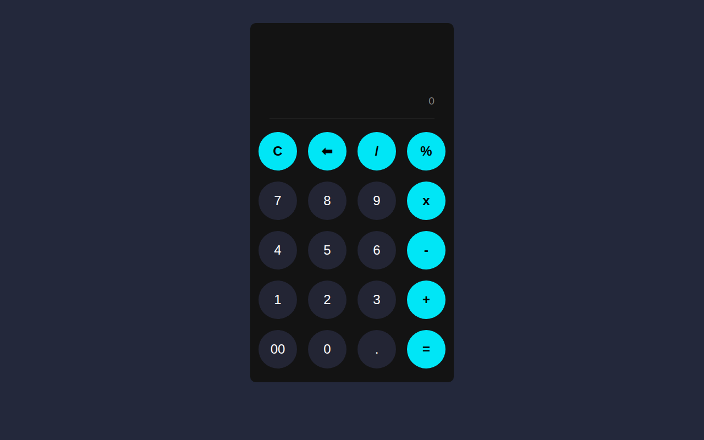

# Calculator

A sleek dark-theme calculator with a live answer display — calculations evaluate in real time as you type.

**Live demo:** https://erionnezha.github.io/Calculator/

## Features

- Real-time evaluation while typing
- Clear (C) and backspace (⌫) buttons
- Percentage, division, multiplication, subtraction, addition
- Decimal and double-zero support
- Dark modern UI

## Tech

- HTML, CSS, vanilla JavaScript
- No dependencies — runs entirely in the browser

## Author

Created by **Erion Nezha**.
